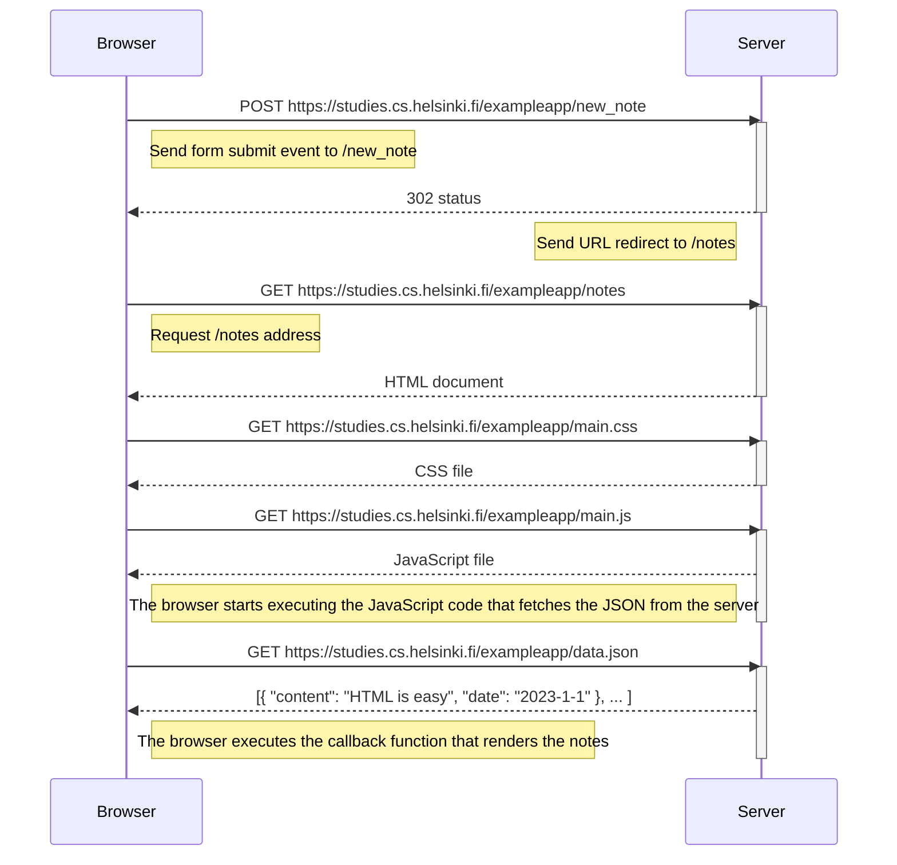

```mermaid
    sequenceDiagram
      participant Browser
      participant Server

      Browser ->> Server: POST https://studies.cs.helsinki.fi/exampleapp/new_note
      activate Server
      Note right of Browser: Send form submit event to /new_note
      Server -->> Browser: 302 status
      deactivate Server
      Note left of Server: Send URL redirect to /notes

      Browser ->> Server: GET https://studies.cs.helsinki.fi/exampleapp/notes
      activate Server
      Note right of Browser: Request /notes address 
      Server -->> Browser: HTML document
      deactivate Server

      Browser ->> Server: GET https://studies.cs.helsinki.fi/exampleapp/main.css
      activate Server
      Server -->> Browser: CSS file
      deactivate Server

      Browser ->> Server: GET https://studies.cs.helsinki.fi/exampleapp/main.js
      activate Server
      Server -->> Browser: JavaScript file
      Note right of Browser: The browser starts executing the JavaScript code that fetches the JSON from the server
      deactivate Server

      Browser ->> Server: GET https://studies.cs.helsinki.fi/exampleapp/data.json
      activate Server
      Server -->> Browser: [{ "content": "HTML is easy", "date": "2023-1-1" }, ... ]
      Note right of Browser: The browser executes the callback function that renders the notes
      deactivate Server
```
